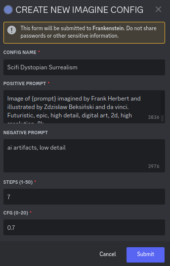
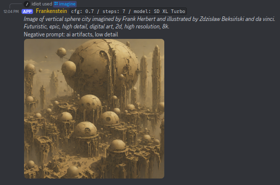
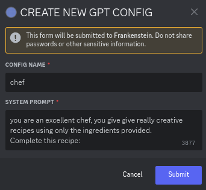
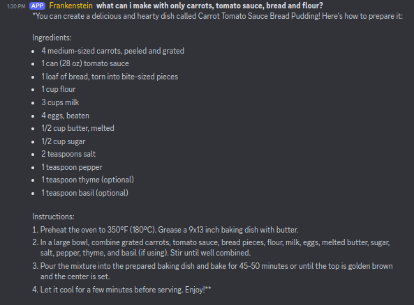

# AI Junction

---
AI Junction exposes a Discord interface for generating text and images using LMStudio (or any OpenAI API interface) and ComfyUI back-ends. The bot allows users to manage their own configurations for both LLM prompting and image generation, as well as generate content in-server using custom prompts.

## Features

- LLM-based text generation using LMStudio
- Image generation using ComfyUI
- Custom configuration management for both GPT and image generation settings
- User-friendly Discord interface for managing settings and generating content










## Prerequisites

Before installing the AI Junction bot, ensure you have the following:

- Node.js (v16.20.1 or higher)
- npm
- A Discord account and a registered Discord application/bot
- Access to LMStudio server and/or
- Access to ComfyUI server
- MongoDB database (get a free hosted instance here https://www.mongodb.com/cloud/atlas/register)

---

## Installation

1. Clone the repository:
```bash
git clone https://github.com/p4stoboy/AI-Junction.git
cd AI-Junction
```

2. Install dependencies:
```bash
npm install
```

3. Rename `.env.example` to `.env` and fill in the required environment variables:
```
DISCORD_TOKEN=your_discord_bot_token
CLIENT_ID=your_discord_app_client_id
MONGODB_URI=your_mongodb_connection_string
LMSTUDIO_URL=http://localhost:1234/v1
COMFY_URL=http://127.0.0.1:8188
COMFY_WS=ws://127.0.0.1:8188
ENABLE_GPT=true
ENABLE_COMFY=true
GLOBAL_ADMIN_ID=your_discord_user_id
```

4. Remove `.example` and edit model mappings in `model_mappings.example.json` to match the models available in your ComfyUI server:
- display_name: The name that will be displayed in the bot's settings menus
- model: The exact name of the model as it appears in the ComfyUI server
- default_model: The model that will be selected by default when creating a new image generation configuration

*all fields are required*
```json
{
    "maps": [
        {
            "model": "anythingMidjourneyV4_v1.ckpt",
            "display_name": "Anything Midjourney V4"
        },
        {
            "model": "sd_xl_turbo_1.0_fp16.safetensors",
            "display_name": "SD XL Turbo"
        },
        {
            "model": "unfiltredai.safetensors",
            "display_name": "Unfiltered AI"
        }
    ],
    "default_model": "sd_xl_turbo_1.0_fp16.safetensors"
}
```


4. Build the project:
```bash
npm run build
```

5. Deploy commands to Discord:
```bash
npm run deploy-commands
```
*note*: **Ensure that the ENABLE_COMFY / ENABLE_GPT variables are set to false if you are not supporting the corresponding back-end, this will disable the corresponding commands.**

6. Start the bot:
```bash
npm start
```

---

## Usage

### GPT Commands

- `/gptsettings`: Manage GPT configuration settings
- This command opens an interactive menu to create, edit, or select GPT configurations.

- `/gpt <prompt>`: Generate text using GPT
- Example: `/gpt Write a short story about a robot learning to paint`

### Image Generation Commands

- `/imaginesettings`: Manage image generation configuration settings
    - This command opens an interactive menu to create, edit, or select image generation configurations.
    - When creating or editing a configuration, you'll set a positive prompt template. This template can include a `{prompt}` wildcard, which will be replaced with the user's input when using the `/imagine` command.
    - Example template: "A detailed painting of {prompt} in the style of Van Gogh"

- `/imagine <prompt> [options]`: Generate an image
    - Basic usage: `/imagine A serene lake with mountains`
    - The `<prompt>` will replace the `{prompt}` wildcard in your active configuration's positive prompt template.
    - Optional override parameters:
        - `positive_prompt`: Override the entire positive prompt template
        - `negative_prompt`: Override the negative prompt
        - `steps`: Override the number of generation steps (1-50)
        - `cfg`: Override the CFG scale (0-20)
        - `model`: Override the selected model

  Examples with override parameters:
    - `/imagine A serene lake with mountains steps:30 cfg:7.5`
    - `/imagine A futuristic cityscape model:"SD XL Turbo" negative_prompt:"clouds, birds"`
    - `/imagine An alien landscape positive_prompt:"Otherworldly terrain with {prompt}, vibrant colors" cfg:8`

### Configuration Quick-Edit Commands

- `/cfg <value>`: Update the CFG value in your active Imagine config
- Example: `/cfg 1.7`
- Valid range: 0-20

- `/steps <value>`: Update the steps value in your active Imagine config
- Example: `/steps 20`
- Valid range: 1-50

- `/model <name>`: Update the model in your active Imagine config
- Example: `/model "SD XL Turbo"`
- Use the exact name of the model as it appears in the settings menu


## Configuration Options

### GPT Settings
- Config Name: A unique name for your GPT configuration
- System Prompt: The initial prompt that sets the context for the AI

### Image Settings
- Config Name: A unique name for your image configuration
- Positive Prompt: The main prompt for image generation
- Negative Prompt: Prompt for elements to avoid in the image
- Steps: Number of generation steps (1-50)
- CFG: Classifier Free Guidance scale (0-20)
- Model: Select from available image generation models

## Troubleshooting

- If commands are not working, ensure you've run the `deploy-commands` script and that your bot has the necessary permissions in your Discord server.
- Check the console logs for any error messages if the bot is not responding as expected.
- Ensure that both LMStudio and ComfyUI servers are running and accessible at the URLs specified in your `.env` file.
- If you're experiencing issues with a specific configuration, try creating a new one to see if the problem persists.

## Contributing

Contributions are welcome. Please feel free to submit a Pull Request.

